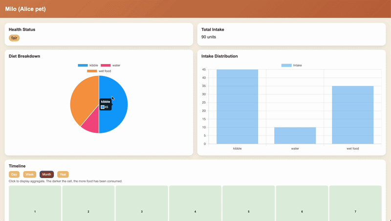

# 🐾 Pet Dashboard

</image>

```
- backend.py
- frontend.html
- prompt.md (initial LLM vibe prompt)
- personality_test.json # personality quiz questions
- data.json # where pet dietary data is read
```

## How to Run

```bash
python3 backend.py
```

Then open in the web browser:

<pre class="overflow-visible! px-0!" data-start="713" data-end="743"><div class="relative w-full mt-4 mb-1"><div class=""><div class="relative"><div class="h-full min-h-0 min-w-0"><div class="h-full min-h-0 min-w-0"><div class="border border-token-border-light border-radius-3xl corner-superellipse/1.1 rounded-3xl"><div class="h-full w-full border-radius-3xl bg-token-bg-elevated-secondary corner-superellipse/1.1 overflow-clip rounded-3xl lxnfua_clipPathFallback"><div class="relative"><div class="pe-11 pt-3"><div class="relative z-0 flex max-w-full"><div id="code-block-viewer" dir="ltr" class="q9tKkq_viewer cm-editor z-10 light:cm-light dark:cm-light flex h-full w-full flex-col items-stretch ͼs ͼ16"><div class="cm-scroller"><pre class="cm-content q9tKkq_readonly m-0"><code><span>http://127.0.0.1:5000/</span></code></pre></div></div></div></div></div></div></div></div></div><div class=""><div class=""></div></div></div></div></div></pre>

## `data.json`

```
{
  "pets": [
    {
      "name": "Milo",
      "owner": "Alice",
      "records": [
        {
          "time": "2026-05-22 08:00",
          "item": "kibble",
          "amount": 20
        }
      ]
    }
  ]
}
```

* `time` format must be: `YYYY-MM-DD HH:MM`
* `amount` is numeric intake value
* multiple pets supported (currently only first pet is used)

## `personality_test.json`

```
{
  "questions": [
    {
      "question": "How active is your pet?",
      "options": [
        "Very active",
        "Moderately active",
        "Calm",
        "Very lazy"
      ]
    },
    {
      "question": "How does your pet eat?",
      "options": [
        "Fast",
        "Normal",
        "Slow",
        "Picky"
      ]
    }
  ]
}
```

* Must contain a `questions` array
* Each question must have:
  * `question` (string)
  * `options` (array of strings)
